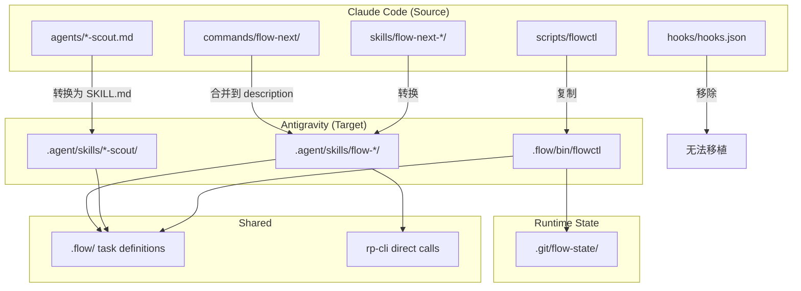

# Convert flow-next to Antigravity Skills

## Overview

将 Claude Code 的 flow-next 插件转换为 Google Antigravity 兼容的 Agent Skills 格式，同时保持 RepoPrompt 集成能力。

**背景**: Google Antigravity (2026年1月) 采用了与 Claude Code 相同的 Agent Skills 开放标准 (SKILL.md 格式)。这意味着大部分技能定义可以直接移植，但需要处理平台特有功能的差异。

**核心发现**:
- SKILL.md 格式完全兼容（YAML frontmatter + Markdown body）
- 目录结构不同: Claude 用 `.claude/skills/`，Antigravity 用 `.agent/skills/`
- Claude 独有功能无法移植: `context: fork`, `allowed-tools`, hooks 系统
- RepoPrompt 通过 rp-cli 直接调用（MCP 作为可选增强）

## Source Snapshot

**源仓库**: `https://github.com/gmickel/gmickel-claude-marketplace`
**Commit SHA**: `af1a1aec8a11b3e2c4c8a510a28bfda15b392db9`
**待复制目录**:
- `plugins/flow-next/skills/` → `.agent/skills/`
- `plugins/flow-next/agents/` → `.agent/skills/` (转换为 SKILL.md 格式)
- `plugins/flow-next/scripts/flowctl` → `.flow/bin/flowctl`

## Scope

### In Scope
- 核心技能移植: flow-next, flow-next-plan, flow-next-work, flow-next-interview
- 审查技能移植: flow-next-plan-review, flow-next-impl-review
- 子代理移植: repo-scout, context-scout, practice-scout, docs-scout, github-scout
- RepoPrompt 集成验证 (rp-cli 为主，MCP 为可选)
- flowctl CLI 适配 (支持任意 cwd)
- 用户文档更新

### Out of Scope
- Ralph 自主模式 (依赖 hooks 系统，Antigravity 无等效功能)
- Hook 系统移植 (Antigravity 无支持)
- Commands 目录移植 (合并到 SKILL.md description)
- 新功能开发

## Architecture



**说明**: `.flow/` 存储任务定义和规范（tracked），`.git/flow-state/` 存储运行时状态（untracked，支持 worktree 并行）。

## Path Resolution Strategy

**关键规则**: flowctl 必须支持任意 cwd 调用。

**实现方案**:
1. 所有技能首先定位 repo root: `REPO_ROOT="$(git rev-parse --show-toplevel)"`
2. 然后拼接 flowctl 路径: `"$REPO_ROOT/.flow/bin/flowctl"`
3. 不使用相对路径 `.flow/bin/flowctl`

**`$CLAUDE_PLUGIN_ROOT` 替换规则**:
- 作为目录引用时 → `$REPO_ROOT`
- 拼接 `/scripts/flowctl` 时 → `$REPO_ROOT/.flow/bin/flowctl`
- 引用模板/资源时 → `$REPO_ROOT/.flow/templates/` 或技能目录内

## Phases

### Phase 1: Foundation (任务 1-2)
- 验证 Antigravity 环境、cwd 规则、工具映射
- 创建基础目录结构，配置 flowctl 路径

### Phase 2: Core Skills (任务 3-4)
- 移植核心技能 (flow-next, plan, work)
- 移植审查技能 (plan-review, impl-review)

### Phase 3: Subagents (任务 5)
- 移植研究子代理 (scouts)
- 工具降级策略 (无工具时提供手动指引)

### Phase 4: Integration (任务 6)
- RepoPrompt 集成验证 (rp-cli 优先)
- MCP 作为可选增强

### Phase 5: Documentation (任务 7)
- 更新用户文档
- 创建迁移指南

## Alternatives Considered

### 1. 完整功能移植 vs 核心功能移植
**选择**: 核心功能移植
**原因**: Ralph 模式和 hooks 系统在 Antigravity 中无等效实现

### 2. 单一 SKILL.md vs 分离的 skills
**选择**: 分离的 skills
**原因**: 保持模块化，符合两个平台的最佳实践

### 3. 硬编码路径 vs 动态路径解析
**选择**: 动态 repo root 解析
**原因**: 支持任意 cwd 调用，更可靠

### 4. MCP vs rp-cli 直接调用
**选择**: rp-cli 直接调用为主
**原因**: 更可靠，MCP 兼容性未确认

## Path/Reference Validation Matrix

| 引用类型 | 示例 | 验收标准 |
|---------|------|----------|
| SKILL.md → reference file | `[phases.md](phases.md)` | 技能加载时可读取 |
| SKILL.md → flowctl | `$REPO_ROOT/.flow/bin/flowctl` | 任意 cwd 可执行 |
| flowctl → .flow/ | `.flow/epics/fn-N.json` | 相对于 repo root |
| rp-cli → repo | `--repo-root "$REPO_ROOT"` | 明确指定 repo |

## Tool Mapping (Claude → Antigravity)

| Claude Tool | Antigravity 等效 | 降级策略 |
|-------------|-----------------|----------|
| Grep | 文件搜索工具 | 提示用户执行 `grep` |
| Glob | 文件模式匹配 | 提示用户执行 `find` |
| Read | 文件读取 | 提示用户提供内容 |
| Task (subagent) | 待验证 | 顺序执行 |
| Bash | 命令执行 | 通常支持 |

## Non-Functional Targets (Best Effort)

| 指标 | 目标 | 测量方式 |
|------|------|----------|
| 技能加载时间 | < 2 秒 | 手动计时 |
| SKILL.md 大小 | < 500 行 | `wc -l` |
| rp-cli builder | < 10 秒 | 手动计时 |

## Risks and Mitigations

| 风险 | 影响 | 缓解措施 |
|------|------|----------|
| cwd 不固定 | 高 | 动态 repo root 解析 |
| 工具集合不同 | 中 | 工具映射表 + 降级策略 |
| MCP 不支持 | 中 | 使用 rp-cli 直接调用 |
| 相对路径失效 | 中 | 验收矩阵 + 测试 |

## Rollout Plan

1. **Alpha**: 创建基础技能，验证路径
2. **Beta**: 验证核心流程 (plan → work → done)
3. **GA**: 发布完整技能集，更新文档

## Rollback Plan

保留原始 Claude Code 插件不变，Antigravity 技能在独立目录。如需回滚，删除 `.agent/skills/flow-*` 即可。

## Quick commands

```bash
# 定位 repo root
REPO_ROOT="$(git rev-parse --show-toplevel)"

# 验证 flowctl (任意 cwd)
"$REPO_ROOT/.flow/bin/flowctl" list

# 验证 rp-cli
rp-cli --version
```

## Acceptance Criteria

- [ ] 所有核心技能 (flow-next, plan, work, interview) 在 Antigravity 中可用
- [ ] flowctl 支持任意 cwd 调用
- [ ] rp-cli 集成验证通过（有明确产物证据）
- [ ] 相对路径引用在技能目录下正常工作
- [ ] 工具降级策略已文档化
- [ ] 迁移指南文档完整

## References

- [Agent Skills Specification](https://agentskills.io/specification)
- [Google Antigravity Skills Codelab](https://codelabs.developers.google.com/getting-started-with-antigravity-skills)
- [Claude Code Skills Docs](https://code.claude.com/docs/en/skills)
- [flow-next GitHub](https://github.com/gmickel/gmickel-claude-marketplace/tree/main/plugins/flow-next)
- [RepoPrompt Docs](https://repoprompt.com/docs)

## Docs Updates Required

- CLAUDE.md - 添加 Antigravity 使用说明
- AGENTS.md - 更新跨平台兼容指南
- .flow/usage.md - 添加 Antigravity 路径信息、worktree 说明
