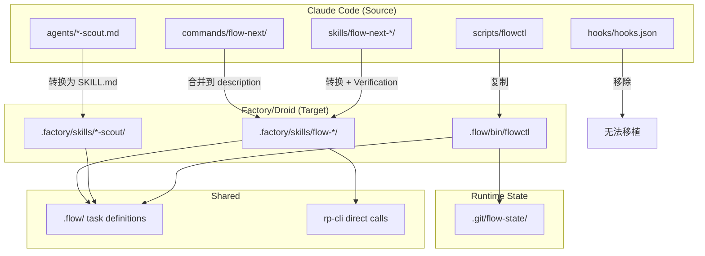

# Convert flow-next to Factory/Droid Skills

## Overview

将 Claude Code 的 flow-next 插件转换为 Factory/Droid 兼容的 Agent Skills 格式，同时保持 RepoPrompt 集成能力。

**背景**: Factory/Droid (https://factory.ai/) 采用与 Claude Code 相同的 Agent Skills 开放标准 (SKILL.md 格式)。大部分技能定义可直接移植，但需处理 Factory 特有要求。

**与 fn-1-gs3 (Antigravity) 的关系**:
- fn-1-gs3 目标目录: `.agent/skills/` (Antigravity)
- fn-2-l67 目标目录: `.factory/skills/` (Factory/Droid)
- 可复用 fn-1-gs3 的路径解析策略和工具降级模式
- 两个 epic 可并行执行，互不依赖

**核心发现**:
- SKILL.md 格式完全兼容（YAML frontmatter + Markdown body）
- 目录结构: Factory 用 `.factory/skills/`
- Factory 特有要求: **Verification 节** 必须包含验证命令
- Factory 技能为 **model-invoked**（语义触发），非 slash command
- Claude 独有功能无法移植: `context: fork`, `allowed-tools`, hooks 系统
- RepoPrompt 通过 rp-cli 直接调用（MCP 作为可选增强）

## Source Snapshot

**源仓库**: `https://github.com/gmickel/gmickel-claude-marketplace`
**Commit SHA**: `af1a1aec8a11b3e2c4c8a510a28bfda15b392db9`
**待复制目录**:
- `plugins/flow-next/skills/` → `.factory/skills/`
- `plugins/flow-next/agents/` → `.factory/skills/` (转换为 SKILL.md 格式)
- `plugins/flow-next/scripts/flowctl` → `.flow/bin/flowctl` (已存在，共享)

## Scope

### In Scope
- 核心技能移植: flow-next, flow-next-plan, flow-next-work, flow-next-interview
- 审查技能移植: flow-next-plan-review, flow-next-impl-review
- 子代理移植: repo-scout, context-scout, practice-scout, docs-scout, github-scout
- 为所有 SKILL.md 添加 Verification 节
- 重写 description 为语义触发（非 slash command）
- RepoPrompt 集成验证 (rp-cli 为主，MCP 为可选)
- flowctl CLI 适配 (已在 fn-1-gs3 完成，共享)
- 用户文档更新

### Out of Scope
- Ralph 自主模式 (依赖 hooks 系统)
- Hook 系统移植 (Factory 无支持)
- Commands 目录移植 (合并到 SKILL.md description)
- 新功能开发
- Factory CLI 安装和配置

## Architecture



## Factory-Specific Requirements

### 1. Verification Section (必需)

每个 SKILL.md 必须包含 Verification 节。使用 4-backtick 格式避免嵌套问题:

````markdown
## Verification

```bash
REPO_ROOT="${REPO_ROOT:-$(git rev-parse --show-toplevel 2>/dev/null || true)}"
if [ -z "$REPO_ROOT" ]; then
  echo "Error: Set REPO_ROOT=/absolute/path/to/repo"
  exit 1
fi

# 验证命令
ls "$REPO_ROOT/.factory/skills/<skill-name>/SKILL.md"
# 预期: 文件存在，退出码 0
```
````

### 2. Model-Invoked Descriptions

Factory 技能通过语义匹配触发，非 slash command。description 需重写:

| Claude Code (slash command) | Factory (semantic) |
|----------------------------|-------------------|
| "Triggers: /flow-next:plan" | "Plan and design feature implementations with structured task breakdown" |
| "Use when user runs /commit" | "Create git commits with proper formatting and attribution" |

### 3. Single-Responsibility Principle

复杂编排技能保持单一入口，description 清晰说明职责边界。

## Path Resolution Strategy

**与 fn-1-gs3 共享**: flowctl 支持任意 cwd 调用，含降级处理。

```bash
REPO_ROOT="${REPO_ROOT:-$(git rev-parse --show-toplevel 2>/dev/null || true)}"
if [ -z "$REPO_ROOT" ]; then
  echo "Error: Set REPO_ROOT=/absolute/path/to/repo (git rev-parse failed; cwd may be outside repo)."
  exit 1
fi
"$REPO_ROOT/.flow/bin/flowctl" <command>
```

**规则**: 若 `git rev-parse` 失败（cwd 在 repo 外），技能应输出清晰错误并退出。

## Phases

### Phase 1: Foundation (任务 1-2)
- 验证 Factory 环境和目录结构
- 创建 `.factory/skills/` 基础目录

### Phase 2: Core Skills (任务 3-4)
- 移植核心技能 + Verification
- 移植审查技能 + Verification

### Phase 3: Subagents (任务 5)
- 移植研究子代理 (scouts) + Verification
- 工具降级策略

### Phase 4: Integration (任务 6)
- RepoPrompt 集成验证

### Phase 5: Documentation (任务 7)
- 更新用户文档
- 创建 Factory 使用指南

## Tool Mapping (Claude → Factory)

| Claude Tool | Factory 等效 | 降级策略 |
|-------------|-------------|----------|
| Grep | 文件搜索工具 | 提示用户执行 `grep` |
| Glob | 文件模式匹配 | 提示用户执行 `find` |
| Read | 文件读取 | 提示用户提供内容 |
| Task (subagent) | 待验证 | 顺序执行 |
| Bash | 命令执行 | 通常支持 |
| WebSearch | 网络搜索 | 提示用户手动搜索 |
| WebFetch | URL 获取 | 提示用户手动访问 |
| git | git CLI | 通常支持 |
| gh | gh CLI | 提示用户执行 `gh` 命令 |
| rp-cli | rp-cli | macOS only，降级到 repo-scout |

## Alternatives Considered

### 1. 共享 .agent/skills/ vs 独立 .factory/skills/
**选择**: 独立目录
**原因**: Factory 标准使用 `.factory/skills/`，与 Antigravity 的 `.agent/skills/` 不同

### 2. 依赖 fn-1-gs3 vs 独立执行
**选择**: 独立执行，共享 flowctl
**原因**: 两个平台目录不同，但 flowctl 和 `.flow/` 状态可共享

### 3. 重写 description vs 保持原样
**选择**: 重写为语义触发
**原因**: Factory 使用 model-invoked 模式，非 slash command

## Risks and Mitigations

| 风险 | 影响 | 缓解措施 |
|------|------|----------|
| Factory 工具集合不同 | 高 | 任务 1 验证，工具映射表 |
| Verification 格式不明确 | 中 | 参考 Factory 文档和示例 |
| Model-invoked 触发不准确 | 中 | 精心设计 description |
| rp-cli macOS only | 中 | 平台检测 + 降级提示 |

## Quick commands

```bash
# 定位 repo root
REPO_ROOT="$(git rev-parse --show-toplevel)"

# 验证 flowctl
"$REPO_ROOT/.flow/bin/flowctl" list

# 验证 Factory skills 目录
ls -la "$REPO_ROOT/.factory/skills/"
```

## Acceptance

- [ ] 所有核心技能 (flow-next, plan, work, interview) 在 Factory 中可用
- [ ] 所有 SKILL.md 包含 Verification 节
- [ ] 所有 description 为语义触发格式（非 slash command）
- [ ] flowctl 支持任意 cwd 调用 (共享 fn-1-gs3)
- [ ] rp-cli 集成验证通过
- [ ] 工具降级策略已文档化
- [ ] Factory 使用指南文档完整

## References

- [Factory AI Documentation](https://docs.factory.ai/)
- [Factory Skills Configuration](https://docs.factory.ai/cli/configuration/skills)
- [Agent Skills Specification](https://agentskills.io/specification)
- [flow-next GitHub](https://github.com/gmickel/gmickel-claude-marketplace/tree/main/plugins/flow-next)
- [fn-1-gs3 Epic (Antigravity)](../specs/fn-1-gs3.md)
